# Neutron to Osmosis Crosschain LPer
This Valence Program allows tokens on the Neutron chain to be transferred to Osmosis where they are utilized to provide liquidity in the DEX.

## Overview

The program sets up two accounts on Neutron and three accounts on Osmosis to create a complete cross-chain liquidity provision flow:
- ATOM tokens in account N1 are sent to O1 via the Neutron IBC Transfer Library (routing through Cosmos Hub)
- stATOM tokens in account N1 are sent to O1 via the Neutron IBC Transfer Library (routing through Stride)
- From O1, the Osmosis CL LPer library provides liquidity to a specified Concentrated Liquidity pool. The position is held by Account O2
- Later the position can be withdrawn into Account O3 using the Osmosis CL Withdrawer library
- From O3, ATOM tokens are sent back to Account N2 via the Generic IBC Transfer Library (routing through Cosmos Hub)
- From O3, stATOM tokens are sent back to Account N2 via the Generic IBC Transfer Library (routing through Stride)
- For demo purposes, a forwarder enables tokens to be sent back to N1, completing the loop

## Architecture

```mermaid
flowchart TD
   subgraph Neutron 
      direction LR
      N1((Account N1<br/>Input))
      N2((Account N2<br/>Output))

      NIBC_ATOM[Neutron IBC<br/>ATOM via Cosmos Hub]
      NIBC_STATOM[Neutron IBC<br/>stATOM via Stride]
      F[Forwarder<br/>N2→N1]
   end

   subgraph Osmosis 
      direction LR
      O1((Account O1<br/>Receive))
      O2((Account O2<br/>LP Position))
      O3((Account O3<br/>Withdraw))

      OLP[Osmosis CL<br/>LPer]
      OLW[Osmosis CL<br/>Withdrawer]
      OIBC_ATOM[Generic IBC<br/>ATOM via Cosmos Hub]
      OIBC_STATOM[Generic IBC<br/>stATOM via Stride]
   end

   N1 --> NIBC_ATOM --> O1
   N1 --> NIBC_STATOM --> O1
   O1 --> OLP --> O2
   O2 --> OLW --> O3
   O3 --> OIBC_ATOM --> N2
   O3 --> OIBC_STATOM --> N2

   N2 --> F --> N1
```



## Components

1. **Neutron Accounts**
   - `account_N1`: Input account on Neutron chain for ATOM and stATOM tokens
   - `account_N2`: Output account on Neutron chain for returned tokens

2. **Osmosis Accounts**
   - `account_O1`: Receiving account for IBC transfers from Neutron
   - `account_O2`: Liquidity position account that holds LP tokens
   - `account_O3`: Withdrawal account for liquidity positions

3. **Libraries**
   - `neutron_ibc_atom_transfer`: Handles ATOM IBC transfers from Neutron to Osmosis (via Cosmos Hub)
   - `neutron_ibc_statom_transfer`: Handles stATOM IBC transfers from Neutron to Osmosis (via Stride)
   - `osmosis_cl_lper`: Provides liquidity to Osmosis Concentrated Liquidity pools
   - `osmosis_cl_withdrawer`: Withdraws liquidity from Osmosis CL positions
   - `generic_ibc_atom_transfer`: Handles ATOM IBC transfers back from Osmosis to Neutron (via Cosmos Hub)
   - `generic_ibc_statom_transfer`: Handles stATOM IBC transfers back from Osmosis to Neutron (via Stride)
   - `forwarder`: Enables token forwarding from N2 back to N1 for demo purposes

4. **Authorizations**
   - `IBC_Transfer_Neutron_to_Osmosis_ATOM`: Authorization for ATOM cross-chain transfers from Neutron (via Cosmos Hub)
   - `IBC_Transfer_Neutron_to_Osmosis_STATOM`: Authorization for stATOM cross-chain transfers from Neutron (via Stride)
   - `Provide_Liquidity`: Authorization for providing liquidity to Osmosis pools
   - `Withdraw_Liquidity`: Authorization for withdrawing liquidity positions
   - `IBC_Transfer_Osmosis_to_Neutron_ATOM`: Authorization for ATOM transfers back to Neutron (via Cosmos Hub)
   - `IBC_Transfer_Osmosis_to_Neutron_STATOM`: Authorization for stATOM transfers back to Neutron (via Stride)
   - `Forward_Tokens`: Authorization for forwarding tokens back to N1

## Configuration

The program is configured to:
- Transfer ATOM tokens between Neutron and Osmosis using IBC via Cosmos Hub
- Transfer stATOM tokens between Neutron and Osmosis using IBC via Stride
- Provide liquidity to a specified Osmosis Concentrated Liquidity pool
- Support bidirectional token flows with proper authorization controls
- Include a forwarder for demo purposes to complete the token flow loop
- Use configurable pool parameters and maximum amounts for security

**Configuration Parameters**: See [`program_params/mainnet.toml`](program_params/mainnet.toml) for all configurable parameters including IBC channels for both Cosmos Hub and Stride routing, pool settings, token denominations, and security limits.

## Deployment

1. **Prerequisites**
   - Rust and Cargo installed
   - Access to Neutron and Osmosis chains
   - Required environment variables set in `.env`:
     ```
     MANAGER_MNEMONIC="Wallet with tokens on both chains"
     ```

2. **Configure Parameters**
   - Update `program_params/mainnet.toml` with appropriate values for your environment
   - Verify IBC channel IDs are correct for both Cosmos Hub and Stride routing
   - Set appropriate pool parameters and maximum amounts

3. **Deploy the Program**
   ```bash
   cargo run -p neutron_to_osmosis_crosschain_lper
   ```

4. **Verify Deployment**
   - Check the `output/` directory for:
     - `instantiated-program-config.json`: Contains contract addresses
     - `raw-program-config.json`: Raw program configuration

5. **Post-Deployment**
   - Fund Account N1 with ATOM and stATOM tokens
   - Verify the target Osmosis CL pool exists and is active
   - Test the complete cross-chain liquidity provision flow

## Usage

The program can be used to:
1. Transfer ATOM tokens from Neutron to Osmosis via IBC (routing through Cosmos Hub)
2. Transfer stATOM tokens from Neutron to Osmosis via IBC (routing through Stride)
3. Automatically provide liquidity to a specified Osmosis Concentrated Liquidity pool
4. Withdraw liquidity positions when needed
5. Return ATOM tokens from Osmosis back to Neutron (via Cosmos Hub)
6. Return stATOM tokens from Osmosis back to Neutron (via Stride)
7. Forward tokens back to the original account for continuous operation

## Security

- Each operation has its own authorization with specific constraints
- IBC transfers are secured through the standard IBC protocol with configurable timeouts
- Different routing paths for ATOM (via Cosmos Hub) and stATOM (via Stride) ensure optimal token flow
- Liquidity operations are restricted to authorized pools and amounts
- Forwarding operations can be limited with maximum amount constraints
- Pool parameters (tick ranges) are configurable and validated

## Dependencies

Libraries Used
- Neutron IBC Transfer Library - https://docs.valence.zone/libraries/cosmwasm/neutron_ibc_transfer.html
- Generic IBC Transfer Library - https://docs.valence.zone/libraries/cosmwasm/generic_ibc_transfer.html
- Osmosis CL LPer - https://docs.valence.zone/libraries/cosmwasm/osmosis_cl_lper.html
- Osmosis CL Withdrawer - https://docs.valence.zone/libraries/cosmwasm/osmosis_cl_withdrawer.html
- Valence Forwarder Library - For token forwarding functionality
- Valence Authorization Utils - For authorization management
- Valence Program Manager - For program configuration
- Valence Library Utils - For utility functions

