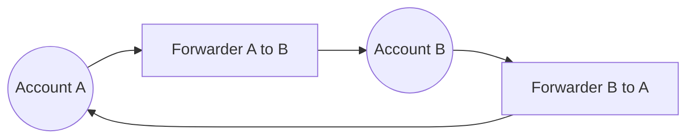

# Osmosis Token Forwarder

This program implements a bidirectional token forwarding system between two accounts on the Osmosis chain using Valence's forwarder library.

## Overview

The program sets up two accounts (A and B) on Osmosis and configures them to forward OSMO tokens to each other. Each direction of forwarding is managed by a separate forwarder library instance, allowing for independent control and monitoring of token flows.

## Architecture



## Components

1. **Accounts**
   - `account_a`: First account on Osmosis chain
   - `account_b`: Second account on Osmosis chain

2. **Forwarder Libraries**
   - `forwarder_a_to_b`: Handles forwarding from Account A to Account B
   - `forwarder_b_to_a`: Handles forwarding from Account B to Account A

3. **Authorizations**
   - `A_to_B`: Authorization for forwarding from A to B
   - `B_to_A`: Authorization for forwarding from B to A

## Configuration

Each forwarder is configured to:
- Forward OSMO tokens (denom: "uosmo")
- No maximum amount limit (unrestricted forwarding)
- Default forwarding constraints

## Deployment

1. **Prerequisites**
   - Rust and Cargo installed
   - Access to Osmosis chain
   - Required environment variables set in `.env`:
     ```
     MNEMONIC="Wallet with tokens"
     ```

2. **Deploy the Program**
   ```bash
   cargo run -p osmosis_token_forwarder
   ```

3. **Verify Deployment**
   - Check the `output/` directory for:
     - `instantiated-program-config.json`: Contains contract addresses
     - `raw-program-config.json`: Raw program configuration

4. **Post-Deployment**
   - Fund Account A and Account B with OSMO tokens
   - Test the forwarding by sending tokens between accounts
   - Monitor the forwarder libraries for successful transfers

## Usage

The program can be used to:
1. Forward OSMO tokens from Account A to Account B
2. Forward OSMO tokens from Account B to Account A
3. Monitor token flows in both directions independently

## Security

- Each direction of forwarding has its own authorization
- Forwarding constraints can be customized if needed
- Maximum amounts can be set to limit transfer sizes

## Dependencies

- `valence-forwarder-library`: For token forwarding functionality
- `valence-authorization-utils`: For authorization management
- `valence-program-manager`: For program configuration
- `valence-library-utils`: For utility functions
